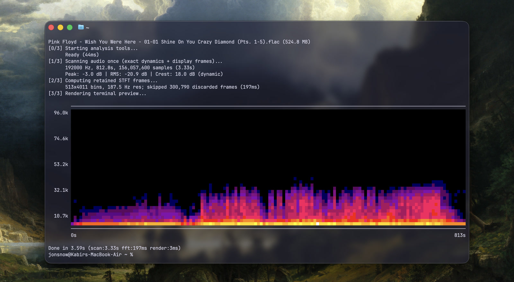

# Spectro 

a tiny python tool to generate spectrograms for audio files and conduct heuristic "lossy source" analysis. 

## How Does It Look?



## Why?

I needed a way to quickly spot resampled or lossy-upconverted audio files. So I built this to:
* Render spectrograms quickly.
* Detect frequency shelf bands and cut-off points.
* Compare two audio files' spectra side by side.
* And honestly, it's really fun (and annoying) to learn this.

No idea why python, I knew that C++ would be faster. But, I don't know C++ well enough to build this in it yet. This was just a fun way to learn more about the math behind audio analysis & more.

## WARNING!

 The results are a hypothesis based on signal processing, not definitive proof of a track's provenance, sample rate, or codec.

`--help`, terminal previews, and ordinary PNG spectrograms keep the heavy analysis stack out of startup. The first `--detect` or `--compare` plot can still pause while SciPy and Matplotlib initialize; spectro prints a status line before that work starts.

## Install

```bash
git clone https://github.com/DamienBlackwood/spectro.git
cd spectro
pipx install .
```

ffmpeg is optional but worth having, it's what handles mp3/m4a decoding and fills in the container info.

The ordinary PNG and terminal modes scan every audio sample once for exact dynamics, but compute only the STFT frames the old renderer ultimately retained. Window centres, Hann weighting, zero-padding, scaling, timestamps, frequency resolution, and dB values match the original full STFT; only results that would be discarded are never allocated. PNG output keeps the original Matplotlib renderer.

## How to use

```
spectro "song.flac"                # basic spectrogram
spectro "song.flac" --detect       # lossy source heuristics
spectro "song.flac" --preview      # spectrogram in the terminal, no PNG
spectro *.flac --detect --sort     # whole folder, worst first
```

**For more details see [MANUAL.md](MANUAL.md).**

## An important remark on detection results

- A "Closest cutoff resemblance" result does not imply that the analyzed audio file meets the criteria of that particular profile. It only tells you which lossy profile's cutoff range looks similar.

- The spectral verdict (PASS / WARN / FAIL / INCONCLUSIVE) does not prove losslessness or lossiness. PASS simply means no obvious lossy signature was found; FAIL means strong evidence of lossy transcoding or upsampling. 

- Lack of ultrasonic energy is normal for archival audio content, so do not immediately assume that your track has been upconverted if it lacks ultrasonic frequencies.

## How well does it actually work?

I stopped guessing and built a corpus. 14 known-lossless tracks spanning 1965 to 2023 and 44.1 / 48 / 96 / 192 kHz: Pink Floyd off analog tape, Dylan, Hans Zimmer, a loud modern hip-hop master, an OST. Then every transcode ffmpeg would give me, decoded back to FLAC so nothing in the container gives it away. 126 files.

**Nothing genuine got flagged.** 13 of 14 came back PASS; the last one is an orchestral piece whose content stops at 9.4 kHz, and it correctly says INCONCLUSIVE rather than guessing.

Transcodes flagged, out of 14 sources each. One encode of the same narrow-band
orchestral source was INCONCLUSIVE in every row; those are shown separately and
are not counted as catches.

| encoder | WARN / FAIL | INCONCLUSIVE |
|---|---:|---:|
| mp3 128 | 12/14 | 1/14 |
| vorbis q4 | 11/14 | 1/14 |
| opus 128 | 9/14 | 1/14 |
| mp3 320 | 8/14 | 1/14 |
| aac 192 | 8/14 | 1/14 |
| Apple aac 128 | 6/14 | 1/14 |
| mp3 V0 | 0/14 | 1/14 |
| Apple aac 256 | 0/14 | 1/14 |

The bottom two are the honest part. Above roughly 21 kHz there is no codec lowpass left to find, and a near-transparent encode looks exactly like a master that simply has full-band content. The genuine files score 2 to 43 out of 100 and the WARN line sits at 45, so there is not much room left to get greedy. Anything that would catch V0 would also start failing real music, which is much worse.

Material matters more than bitrate. Sources that already taper off early (analog tape, quiet orchestral) hide a lowpass well, because there was nothing up there to remove in the first place.

You can run this on your own library:

```bash
python tests/make_corpus.py ~/Music/*.flac
```

It encodes each file at a spread of bitrates in a temp dir, scores everything, and tells you where it was wrong. If the thresholds are off for your kind of music, that's how you'll find out.

All code written and thought out by me, with only minor assistance from AI (in formatting or cleanliness). But mostly drawn from existing research/examples and implemented independently.

## Detection

Detection is a weighted score over seven signals: where the spectral edge sits relative to known codec cutoffs, how steep the transition band is, how deep the shelf is, how much the edge wanders across the frames that reach it, the high/low band energy ratio, SBR likelihood, and whether the shelf holds for the whole track. A separate quality score decides whether the file is even judgeable. Every threshold lives in `Thresholds` in [dataclasses_.py](spectro/dataclasses_.py) if you want to argue with one. The codec cutoff ranges in `CODEC_PROFILES` were measured with ffmpeg apart from HE-AAC, which is still a published estimate.

Slope carries the most weight, because it turned out to be the one signal that separates cleanly: genuine masters top out around -30 dB/kHz and codec shelves run -33 to -100.

## License
This software is licensed under the **MIT License**.
